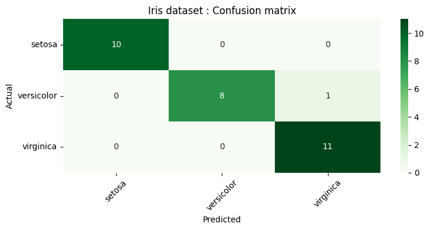

# Task: create a model based on the IRIS dataset, ideally with PyTorch

## Description:

This Model was created using PyTorch, and is based on the IRIS dataset. It is build into steps:

1. Data preparation:
    - Data loading: Iris dataset with sklearn
    - pytorch' dataloader
2. Model selection and training: 
    - Model selection: A neural network with one hidden layer
    - Trianing: CrossEntropyLoss and the Adam optimizer for different numbers of epochs ( we picked above 10)
3. Model evaluation and Visualization:
    - Model evaluation: Calculated Accuracy
    - Visualization: confusion matrix.

## Installation:

- create a virtual environment:

    ``` python -m venv venv ```
- activate the virtual environment:

    ``` source venv/bin/activate ```
- git clone the repository: ( in your terminal)

    ``` git clone https://github.com/bsababu/iris-model-prep.git ```
- install the required packages:

    ``` pip install -r requirements.txt ```
## Run the code:
    - Run jupyter the iris-data-proces.ipynb file:


